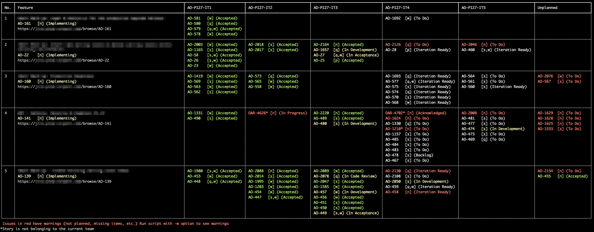
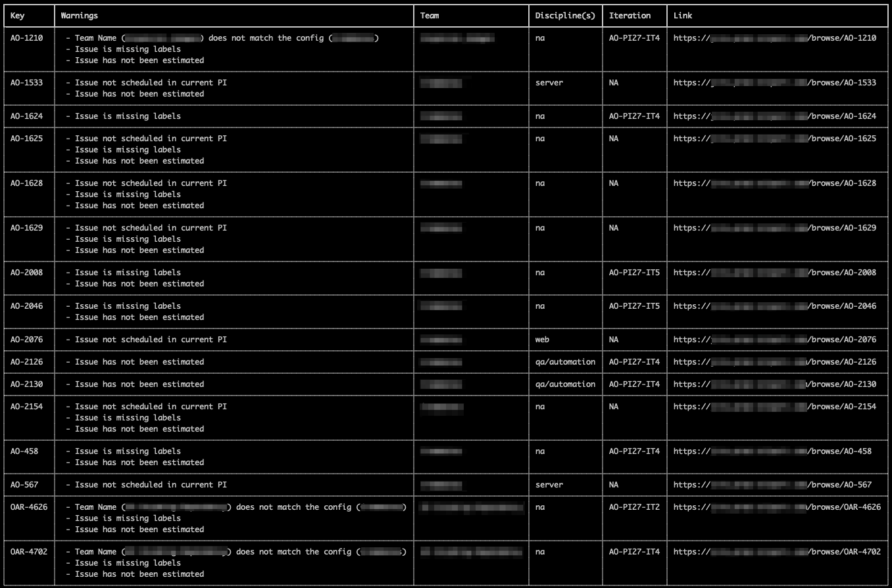
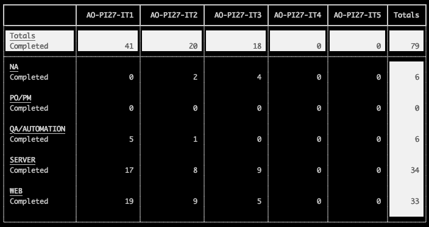

# PI Tools

A command line tool and Mac App for reviewing features, stories, and iterations
in a Scaled Agile (SAFe) environment:

* Quickly see the status of all features/epics in the current PI with color coded story keys for quickly identifying
  issue status

<p align="center">
  
</p>

* A red color highlights a potential issue. Running with the `-w` flag produces a
  list of warnings for these stories

<p align="center">
  
</p>

* Quickly determine the load in each iteration vs. the available capacity

<p align="center">
  
</p>

* Quickly determine the velocity of each iteration in a PI

<p align="center">
  
</p>

# Installation

## Dependencies

All dependencies can be installed using `pipenv`.

1. Install `pipenv` on a Mac using `brew`:

    ```shell
    brew install pipenv
    ```

   Or alternatively, pip:

    ```shell
    pip install pipenv
    ```

2. Install the dependencies:

    ```shell
    pipenv install
    ```

## `.env` file

Create a `.env` file to store Jira credentials locally:

    ```shell
    printf "%s\n" "JIRA_USERNAME='<username>'" "JIRA_PASSWORD='<password>'" >.env
    ```

   Where:
   - `<username>` should be replaced with the username you use to access Jira
   - `<password>` should be replaced with the password you use to access Jira

## Create Bash Alias [OPTIONAL]

For convenience, a bash file is included which simplifies the usage of this script.
To use this, add the following to either the `.bashrc` or `.profile`:

```shell
alias pitools='bash <PATH-TO-DIR>/pitools/pitools.bash'
```

Where:

- `<PATH-TO-DIR>` should be replaced with the location PITools has been installed

# Configuration

## `config.json`

The `config.json` file contains a number of configuration values that determine the output of the script. All are
required.

- `jira` specifies the jira instance you wish to connect to
- `statsOutputDir` specifies the directory where the output file should be created when running with the `stats`
  option (see _Usage_)
- `statsFileName` specifies the file name of the output file when running with the `stats` option (see _Usage_)
- `pi` specifies the PI you wish to review
- `iterations` specifies the specific iteration within the pi you wish to review
- `capacity` specifies the capacity of each discipline. This facilitates the delta load/capacity to be calculated

<mark>**N.B.:** Both `pi` and `iterations` are required to ensure full coverage of the relevant stories; it is possible
in Jira to have stories assigned to an iteration but their parent epic to not be assigned to the same PI, and vice
versa.</mark>

## Jira

This project summarizes the issues (epics, stories, etc.) assigned to a given PI and/or iterations in Jira, and as
specified in the `config.json`.
In order for all the features of this project to be available, there a number of key fields must be used within Jira:

- The `labels` field is used to determine which discipline is contributing to the issue. The options are 'Server', '
  Web', 'Qa/Automation', and 'PO/PM'
- The `Team Name (customfield_15500)` field is used to determine which team the issue is assigned to
- The `Story Points (customfield_10501)` field is used to determine the story point estimate when the story is not
  assigned to multiple disciplines
- The `BE Estimate (customfield_20501)`, `FE Estimate (customfield_20500)`, and `QA Estimate (customfield_20502)` fields
  are used to determine the story point estimate for each discipline that is contributing to the story

<mark>**N.B.:** with the exception of the `labels` field, the other fields are custom fields that must be added to the
jira project configuration. For your project, the specific `customfield` number may be different and can be configured
in the `extract_issue_info` function in `'pitools/utils/issue_parsing.py'`</mark>

# Usage

If using the convenience bash file provided, the script can be run with the following:

```shell
pitools [cmd]
```

where `[cmd]` can be one of the following:

- `overview` for an overview of the PI. Run 'overview -h' for more options
- `stats` to generate a `.tsv` file containing all stories in a given PI, including timing stats. **N.B.:** This is in
  early development stages. Please take care when reviewing the contents of this file

Alternatively, if not using the convenience bash file (and using pipenv):

```shell
pipenv run python <PATH-TO-DIR>/pitools/pitools/pi_tools.py [cmd]
```

Where:

- `<PATH-TO-DIR>` should be replaced with the location PITools has been installed

# [OPTIONAL] Building with PyInstaller

PITools can be run as a standard Mac app. Use the following instructions to build the app.

<details><summary><b>Show instructions</b></summary>
To build the mac app, run the following command:

```shell
python mac_app_builder.py
```

This will create a mac executable / app in the `dist` folder that can be zipped and shared with others.

The build script was created
following [this guide](https://medium.com/@jackhuang.wz/in-just-two-steps-you-can-turn-a-python-script-into-a-macos-application-installer-6e21bce2ee71)

## Running the Application

The app can be run like any other mac application by simply double-clicking the `pi_planning_tools` application located
in the application folder

**NOTE:** The app is not signed and so Mac Gatekeeper will not allow the application to be run the first time it is
clicked. For a solution, see _Known Issues_

## Known Issues

### OSError: Python library not found: <libraries>

When creating a standalone package, `PyInstaller` requires a development python installation or to use a shared lib.

**Solution:** rebuild python library:

```bash
env PYTHON_CONFIGURE_OPTS="--enable-shared" pyenv install <python version>
```

See this [accepted stack overflow answer](https://stackoverflow.com/a/59606319)

### pi_planning_tools can't be opened because Apple cannot check it for malicious software

Apple requires apps to be signed by the developer using their authentication program. This app is not enrolled in the
program.

**Solution:** the app must be opened using the steps described
in [this guide](https://support.apple.com/en-gb/guide/mac-help/mh40616/mac) (control click application file and select
open).

This will likely have to be repeated for the apps dependencies (dylib's)
</details>